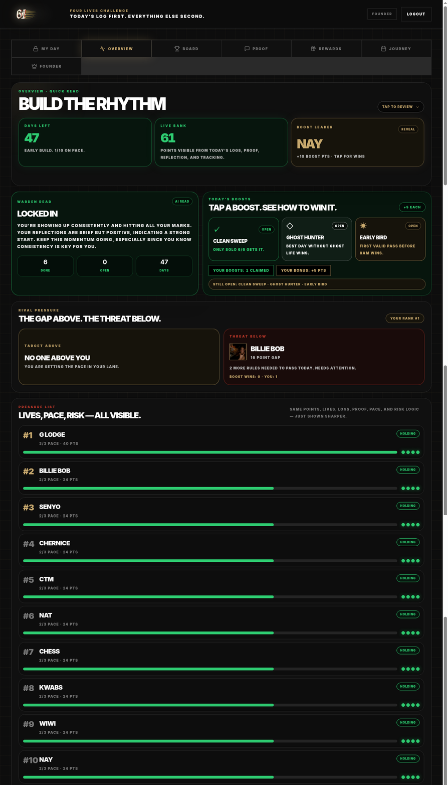

# Overview Page Design Handoff for Claude

**Author:** Manus AI  
**Project:** 6+1 Four Lives Challenge  
**Purpose:** This is a **non-build handoff**. It explains the current Overview page so it can be taken into Claude for better design, wording, usability, and intuitive function suggestions. No app code was changed for this handoff.

## Executive Summary

The Overview page is designed as the participant’s **challenge intelligence dashboard**. It is not the daily logging screen and it is not the full leaderboard. Its current purpose is to help a participant quickly understand the state of the challenge, the current room pressure, today’s boost opportunities, their closest rival context, and who is at risk.

At a high level, the page answers five questions. First, **where are we in the challenge?** Second, **how much work has been banked today?** Third, **who is winning boost points?** Fourth, **what should I understand about my own pressure and nearby rivals?** Fifth, **who is currently safe, slipping, or at risk?** The current design uses a dark, high-pressure, poster-like visual style with black backgrounds, white uppercase typography, green completion signals, gold reward signals, and red danger signals.

> The best redesign direction is probably not to add more information. The better opportunity is to make the existing information feel more **obvious, guided, and action-led**, so a user immediately knows what to do next after scanning the Overview.

## Current Page Structure

The page sits behind the top navigation tab labelled **Overview**. The wider app has a header, account controls, and tab navigation for **My Day**, **Overview**, **Board**, **Proof**, **Rewards**, **Journey**, and **Founder**. The Overview itself is a vertically stacked page made of four main content zones.

| Page Zone | What It Shows Now | Current User Meaning | Current Interaction |
|---|---|---|---|
| **Quick Read** | Headline such as “Build the rhythm,” plus Days Left, Live Bank, and Boost Leader cards. | Gives the user a fast read on challenge timing, today’s visible points, and boost momentum. | “Tap to review” expands a group read. “Reveal” opens boost-leader win details. |
| **Warden + Today’s Boosts** | A Warden Read card beside daily boost cards such as Clean Sweep, Ghost Hunter, and Early Bird. | Explains the user’s current behavioural read and shows bonus point opportunities. | Tapping a boost expands plain-language guidance on how to win it. |
| **Rival Pressure** | Two cards: Target Above and Threat Below. | Shows who the participant is chasing and who is chasing them. | Tapping a rival opens that participant’s detail sheet. |
| **Pressure List** | A ranked list with pace, points, risk labels, progress bars, and life dots. | Shows the room by risk/pressure rather than just a classic leaderboard. | Tapping a participant opens the detail sheet. |

## How the Page Works

The Overview page is fed by the app’s challenge snapshot. That snapshot includes challenge state, participants, logs, payments, redemptions, active boosts, boost wins, and the current participant. The page then derives a live interpretation of the room from those data points. It computes participant insights such as points, completed days, current pace, lives remaining, risk, recent proof, today’s completed rules, and status lines.

The **Quick Read** section changes its headline and tone depending on where the challenge is in its timeline. When the challenge is still early, the page uses “Build the rhythm” language and green signals. As the challenge gets closer to the end, the language becomes more urgent and can shift into gold or red pressure language. The **Days Left** metric is therefore not just a countdown; it sets the emotional frame for the rest of the page.

The **Live Bank** card adds up visible points coming from today’s logs, proof, reflection, and tracking. It is meant to show how much valid activity has already been banked today. The wording currently says “Points visible from today’s logs, proof, reflection, and tracking,” which is accurate but may be too system-like for a normal user.

The **Boost Leader** card shows the participant who has earned the most boost points. If someone has boost wins, the card can be expanded to show a short list of the boost types they have won. This section is useful, but the current label “Boost Leader” may not instantly tell a user whether this is all-time boost performance, today’s boost performance, or a bonus-only leaderboard.

The **Warden Read** card shows a short behavioural summary. It uses the participant’s recent activity and Warden mood logic to return a label such as “Locked In,” a tone, and a short message. In the screenshot, it tells the participant that they are showing up consistently and that reflections are brief but positive. This is one of the most personal elements on the page, but it currently competes visually with the boost cards and could be framed more clearly as “your next coaching read” or “what the Warden sees.”

The **Today’s Boosts** section shows daily bonus opportunities. Each boost appears as a small card with an icon, a name, a status such as Open or Claimed, and a short plain-language rule. Tapping a card expands it to explain how the boost is won. The current behaviour is useful because it turns hidden game mechanics into readable instructions. The opportunity is to make the cards feel more action-oriented, for example by showing which boost is most realistic for the user right now.

The **Rival Pressure** section gives the user immediate context around their position. The **Target Above** card shows the person directly above them when there is someone to chase. The **Threat Below** card shows the person directly behind them when there is someone close enough to matter. If the user is first, the Target Above card says that no one is above them. Tapping a rival opens a participant detail sheet, which gives deeper stats and recent compliance context.

The **Pressure List** ranks participants by pressure and risk signals, not simply by first-to-last leaderboard position. Rows include the participant rank, name, pace count, points, a risk label such as Holding, Watch Closely, or Red Zone, a horizontal pace bar, and life dots. This section is information-rich, but it may need better hierarchy because every row currently has a similar visual weight.

## Current Interaction Map

| Interaction | Current Behaviour | Redesign Question for Claude |
|---|---|---|
| **Tap to review** in Quick Read | Expands a hidden group summary with Banked, Opened, and On Pace counts. | Should this be hidden, or should the most important group read be visible by default? |
| **Reveal** on Boost Leader | Expands recent boost wins for the top boost earner. | Should this be a small expandable card, a leaderboard drawer, or a clearer “Why they lead” insight? |
| **Tap a boost card** | Expands the card to show how that boost is won or why it was won. | Should the app recommend the most achievable boost for the current user? |
| **Tap Target Above / Threat Below** | Opens a participant detail sheet. | Should the card also suggest a concrete action, such as “you need X more points to overtake”? |
| **Tap a Pressure List row** | Opens the participant detail sheet with points, streak, days, life status, and recent compliance. | Should row taps be clearer through labels like “View dossier” or a visible chevron? |
| **Back to Board** inside participant sheet | Closes the participant detail overlay. | Since this is opened from Overview, should it say “Back to Overview” instead? |

## What May Be Confusing Today

The page has strong visual energy, but some labels require the user to already understand the app’s internal language. **Live Bank**, **Boost Leader**, **Warden Read**, and **Pressure List** are all meaningful once explained, but a new participant may not instantly know what they are supposed to do with each section. The page also mixes several mental models: countdown, coaching, bonus hunting, rivalry, and risk ranking. All are relevant, but they may need a stronger order of importance.

The page also has a lot of uppercase text. This supports the serious, high-pressure brand, but it can reduce scan speed when every label, heading, body sentence, and microcopy has the same typographic voice. Claude should consider where uppercase is essential for brand impact and where sentence-case or calmer text would improve comprehension.

There is also a possible mismatch between interaction affordance and user expectation. Some elements are clearly button-like, while others look like static stat cards but can be tapped. The page would benefit from more obvious “what happens if I tap this?” signals, especially for participant rows and boost cards.

## Suggested Redesign Goals for Claude

The redesign should keep the dark, serious, accountable brand direction. It should not make the app soft, generic, or corporate. The visual tone should still feel like a challenge environment: black base, gold reward accents, green completion signals, red risk signals, bold typography, and high contrast. However, the information architecture should become more intuitive.

| Goal | What Claude Should Improve | Why It Matters |
|---|---|---|
| **Make the page action-led** | Add a clear “what should I do next?” area near the top. | Users should not only understand status; they should know the next best move. |
| **Clarify hidden concepts** | Rename or explain Live Bank, Boost Leader, and Pressure List in plain language. | Reduces cognitive load for new participants. |
| **Improve hierarchy** | Make the top scan answer: time left, my status, immediate opportunity, immediate risk. | Prevents the page from feeling like several dashboards stacked together. |
| **Expose useful recommendations** | Suggest the most achievable boost, nearest rival action, or risk warning. | Creates the “intuitive functions that just make sense” feeling. |
| **Separate personal vs group intelligence** | Distinguish “about me” from “about the room.” | Helps users understand which parts require their action. |
| **Make tap targets self-explanatory** | Use clearer labels, chevrons, badges, or microcopy. | Reduces uncertainty and improves usability. |

## Intuitive Function Ideas to Ask Claude For

Claude should be asked to propose features that feel obvious in this challenge context rather than random additions. Good additions would turn the current dashboard into a coachable, action-oriented Overview.

| Proposed Intuitive Function | Description | Where It Could Live |
|---|---|---|
| **Next Best Move** | A single top-card recommendation, such as “Submit proof now,” “You can still win Early Bird,” or “Protect your 4 lives today.” | Directly under Quick Read or beside Warden Read. |
| **Boost Fit Score** | Each boost card could show whether it is realistic for the current user today: “High chance,” “Still possible,” or “Missed window.” | Inside Today’s Boosts. |
| **Rival Gap Translator** | Instead of only saying “16 point gap,” explain what closes the gap, such as “A 6/6 day plus one boost puts you within X points.” | Rival Pressure cards. |
| **Risk Reason Drawer** | For each Pressure List row, reveal why the app labels someone Holding, Watch Closely, or Red Zone. | Pressure List row expansion. |
| **My Position Summary** | A sticky mini-summary: rank, lives, today’s status, closest rival, boost opportunity. | Top or bottom sticky bar on mobile. |
| **Plain-English Tooltips** | Short definitions for Live Bank, Boost, Pace, Risk, and Lives. | Micro info icons or tap-to-explain chips. |
| **Today vs Overall Toggle** | Let users switch between today’s room pressure and total challenge pressure. | Pressure List header. |
| **Celebrate All-Green State** | When the user has completed today’s requirements, the Overview should visibly shift into a protected “all green” state for the day. | Warden Read, Quick Read, and My Position Summary. |

## Wording Issues Claude Should Review

Some current wording is punchy and on-brand, but it can be sharpened for clarity. For example, **“Build the rhythm”** is emotionally strong, but the page could support it with a more direct subtitle: “47 days left. Bank today before the room moves.” **“Live Bank”** could become **“Banked Today”** or **“Room Points Today.”** **“Boost Leader”** could become **“Top Bonus Hunter”** if it means all-time boost wins, or **“Today’s Bonus Leader”** if it means current-day boosts.

| Current Copy | Possible Direction | Reason |
|---|---|---|
| **Build the rhythm** | Keep, but add a direct action subtitle. | Strong brand headline, but needs clearer instruction. |
| **Live Bank** | “Banked Today” or “Today’s Points Banked.” | More obvious to normal users. |
| **Boost Leader** | “Top Bonus Hunter” or “Boost Points Leader.” | Makes the metric more specific. |
| **Tap a boost. See how to win it.** | “Pick a bonus target for today.” | More action-oriented. |
| **The gap above. The threat below.** | Keep, but add “Here’s who matters to you right now.” | Strong phrase, but could be more self-explanatory. |
| **Lives, pace, risk — all visible.** | “Who is safe, slipping, or under pressure.” | More human and easier to scan. |

## Recommended Claude Prompt

Use this prompt with the attached screenshot when asking Claude for design and usability help:

> I’m redesigning the Overview page for a dark, high-pressure challenge app called **6+1 Four Lives Challenge**. The page is not the daily logging screen and not just a leaderboard. It should act as a participant’s challenge intelligence dashboard. It currently shows a quick challenge read, days left, points banked today, boost leader, Warden coaching read, today’s boost opportunities, rival above/below, and a pressure list with pace/risk/lives.
>
> Please review the attached long screenshot and suggest a better UX structure, wording, hierarchy, and intuitive functions that would make this page easier to understand and more useful. Keep the brand serious, dark, bold, accountable, and premium. Do not soften it into a generic dashboard. I want ideas that feel obvious for this type of challenge, such as next-best-action prompts, clearer boost guidance, rival gap explanations, and better risk explanations.
>
> Please do not write code. Give me a redesigned information architecture, improved section names, rewritten microcopy, and a list of smart functions that should exist on this page.

## Final Notes

This handoff deliberately avoids building anything. The goal is to help Claude critique the current Overview page and produce a better design direction. The attached long screenshot is the main visual reference. The explanation above should give enough context for Claude to understand what each section is meant to do, how users interact with it, and where the page can become more intuitive.
